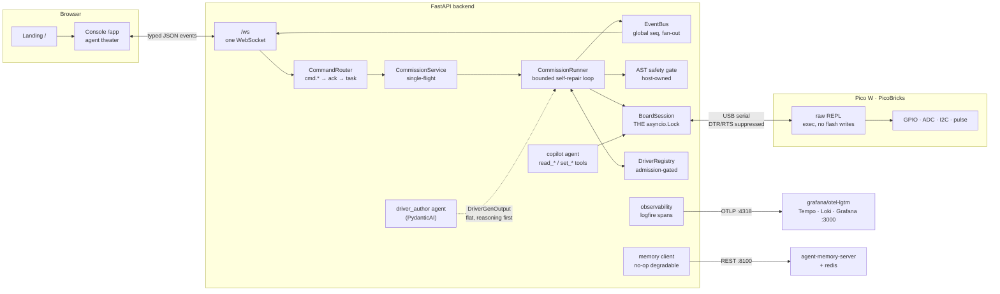
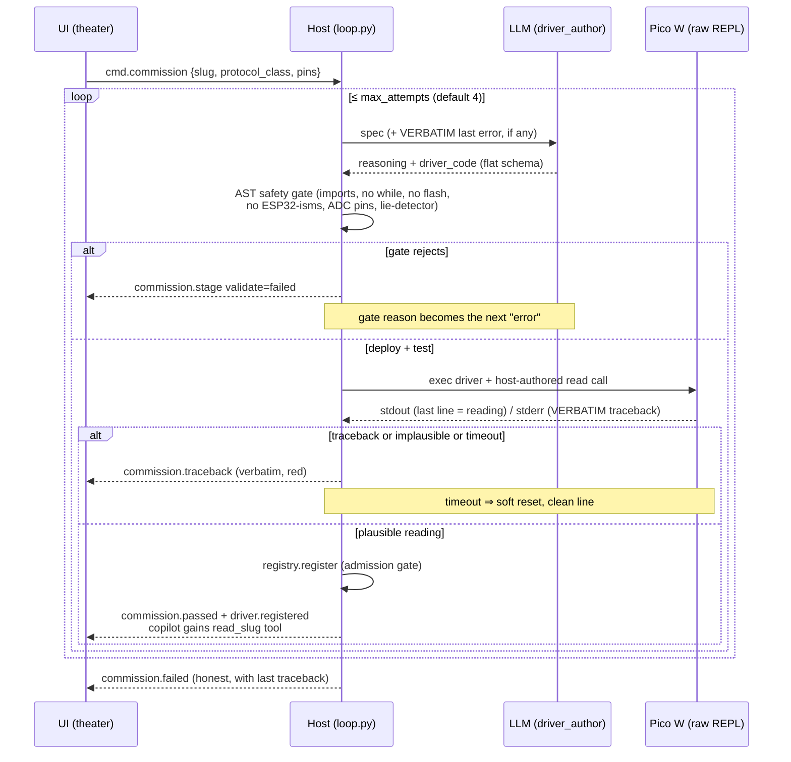

# SelfAware

**Cursor for hardware.** Plug in a sensor, teach it once — an AI agent writes
the MicroPython driver, deploys it to a real Raspberry Pi Pico W over USB
serial, test-reads it on real silicon, and **repairs itself from the board's
own traceback** when something goes wrong.

> Reliability is a property of the **loop**, not the model. Every attempt is
> judged by physical hardware; a traceback from the chip cannot be
> hallucinated, and it steers the next fix.

## Architecture



## The self-repair loop



## Quickstart

Prerequisites: [uv](https://docs.astral.sh/uv/), Node 20+, and — only for the
observability/memory stack — [Docker](https://docs.docker.com/get-docker/)
with the daemon running (Docker Desktop or Colima on macOS). No hardware and
no API key needed for the full mock demo.

```bash
# one-time setup
cd backend && uv sync --group dev && cd ..
cd frontend && npm install && cd ..

# 0. nothing required: no hardware, no API key, no docker
make test        # backend suite — green offline by design

# 1. the full theater, zero dependencies (MockBoard + canned author)
make demo        # backend :8000 (mock) + frontend :5173
#    open http://localhost:5173  →  "> enter the console"
#    or fixtures-only, no backend at all: http://localhost:5173/app?mock=1

# 2. observability + memory (optional; needs the Docker daemon running)
make infra-up    # docker compose: grafana/otel-lgtm (Grafana :3000, OTLP
                 #   :4317/:4318) + agent-memory-server :8100 + redis :6379;
                 #   first run pulls ~1.5 GB of images — start it early.
                 # the SelfAware · Commission Theater dashboard auto-provisions;
                 # backend traces appear under service "selfaware-backend"
make infra-down  # stop the stack (add -v in infra/ to also drop redis data)

# 3. real everything (each switch independent — see degradation matrix)
cp .env.example .env             # add ANTHROPIC_API_KEY for the real author
make dev-backend                 # plug in the Pico W first; port auto-discovered
make dev-frontend
```

The backend never *requires* the containers: if the stack is down, traces are
dropped silently and memory degrades to a no-op client.

| | |
|---|---|
| Dashboard | http://localhost:5173/app |
| Backend health | http://localhost:8000/healthz |
| Grafana (agent traces) | http://localhost:3000 → *SelfAware · Commission Theater* |

## Degradation matrix — everything is optional

| Missing | What still works |
|---|---|
| API key | Everything except real codegen; `SELFAWARE_MOCK_AUTHOR=true` runs the full loop keyless |
| Board | Everything via `SELFAWARE_MOCK_BOARD=true` (explicit — absence of a board is reported honestly, never silently mocked) |
| redis / agent-memory | Everything; memory degrades to a no-op client |
| Grafana LGTM | Everything; OTLP exporter is fail-open |
| **all of the above** | `make test` and `make demo` — the flagship demo has zero external dependencies |

## Repo map

```
backend/selfaware/
  events/         the typed wire language (docs/event-protocol.md is canonical)
  hardware/       raw-REPL bridge, MockBoard, discovery, THE single lock
  bringup/        the bounded loop: gate → deploy → test → repair
  agents/         driver_author + copilot (PydanticAI), streaming bridge
  registry/       verified drivers → live hot-swappable tools
  memory/         agent-memory-server client (no-op degradable) + sqlite-vec stub
  observability/  logfire → OTLP → local Grafana
  api/            create_app factory, /ws, REST, lifespan
frontend/src/     the agent theater (see docs/frontend.md)
infra/            docker-compose (redis, agent-memory, otel-lgtm) + dashboards
docs/             architecture · event-protocol · backend · frontend · agents ·
                  hardware-bringup · observability · demo-runbook
```

## The honesty floor (read before demoing)

- **Tractable:** analog reads, self-identifying I2C devices, single-pulse
  timing — these converge in a few attempts.
- **Harder (don't overclaim):** multi-register state machines, strict
  bit-banged timing (WS2812, quadrature).
- **Physically impossible (never claim):** "auto-detect anything attached."
  A raw voltage cannot reveal what produced it. We auto-identify I2C devices
  (they announce themselves), detect *presence* on ADC pins, and let the human
  teach the rest — once.
- **A plausible number is not a live sensor.** The host checks range *and*
  fingerprints (railed/floating pins), and real liveness means the value
  moves when you cover the LDR.

Docs: [architecture](docs/architecture.md) · [event protocol](docs/event-protocol.md) ·
[hardware bringup](docs/hardware-bringup.md) · [agents](docs/agents.md) ·
[frontend](docs/frontend.md) · [backend](docs/backend.md) ·
[observability](docs/observability.md) · [demo runbook](docs/demo-runbook.md)
